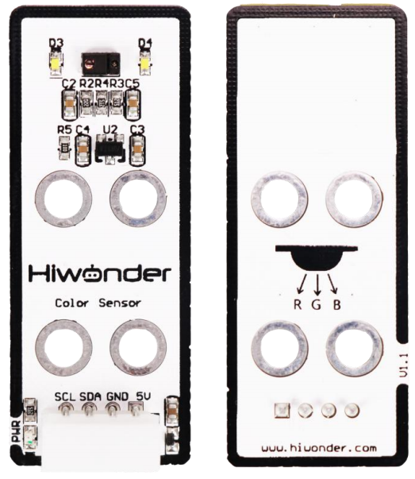
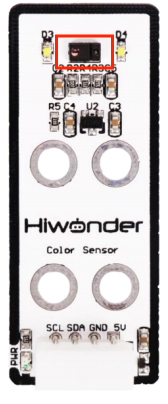

# 1. Color Sensor Manual

## 1.1 Color Sensor Description

### 1.1.1 Sensor Introduction

The color sensor is applied to the detection of object color. It has a wide range of applications, including object color recognition, light intensity detection, and object proximity detection. Additionally, the four directional diodes on the sensor can be used to recognize gesture actions such as up, down, left, and right.

### 1.1.2 Working Principle

This sensor primarily uses the APDS9960 component. It can detect the color of an object, the ambient light intensity, object proximity, and support non-contact gesture detection. It features integrated RGB color detection which enables identification of various colors, ambient light detection to measure light intensity under different lighting conditions, and a built-in infrared LED to support proximity sensing.

## 1.2 Notice

1.  Do not exceed the rated voltage range during use.

2.  Do not use materials that transmit visible light or infrared light as test objects.

3.  Avoid strong light exposure and do not block the light on the test object during use.

4.  Do not operate the sensor in humid environments.

## 1.3 Specifications

For more information of this chip, you may refer to **"[Color sensor schematic](https://drive.google.com/drive/folders/1XhtJ0eFGZ-_mAW-oUM4r3ntd8uJKhmFE?usp=sharing)"**

### 1.3.1 Pin Instruction

| **Pin** | **Instruction** |
| :------ | :-------------- |
| 5V      | Power Input     |
| GND     | Ground          |
| SDA     | SDA Data Cable  |
| SCL     | SCL Clock Line  |

### 1.3.2 Specifications

<table class="docutils-nobg" border="1">
  <tr>
    <th colspan="2" style="text-align: center; background-color: #f2f2f2; padding: 8px;">Color Sensor</th>
  </tr>
  <tr>
    <th style="text-align: left; background-color: #eaeaea; padding: 8px;">Parameter</th>
    <th style="text-align: left; background-color: #eaeaea; padding: 8px;">Specification</th>
  </tr>
  <tr>
    <td rowspan="3" style="padding: 8px;">Color detection and ambient light detection</td>
    <td style="padding: 8px;">RGB colors and mixed colors recognition</td>
  </tr>
  <tr>
    <td style="padding: 8px;">Recognizable light wavelength:465nm~650nm</td>
  </tr>
  <tr>
    <td style="padding: 8px;">Recognition can be performed through dark glass.</td>
  </tr>
  <tr>
    <td rowspan="3" style="padding: 8px;">Programmable infrared LED</td>
    <td style="padding: 8px;">Use infrared LED to provide detection light source, not affected by external ambient light</td>
  </tr>
  <tr>
    <td style="padding: 8px;">The ADC value range of the object's proximity is 1~255.</td>
  </tr>
  <tr>
    <td style="padding: 8px;">Programmable infrared LED</td>
  </tr>
  <tr>
    <td rowspan="3" style="padding: 8px;">Gesture detection</td>
    <td style="padding: 8px;">Directional diode with four directions</td>
  </tr>
  <tr>
    <td style="padding: 8px;">Recognition of gestures such as"up,""down,""left," and "right."</td>
  </tr>
  <tr>
    <td style="padding: 8px;">Programmable infrared LED</td>
  </tr>
  <tr>
    <td style="padding: 8px;">Working voltage</td>
    <td style="padding: 8px;">DC 5V</td>
  </tr>
  <tr>
    <td style="padding: 8px;">Operating Current</td>
    <td style="padding: 8px;">Maximum 100mA</td>
  </tr>
  <tr>
    <td style="padding: 极狐 8px;">Data Interface</td>
    <td style="padding: 8px;">I2C bus with a maximum clock rate of 400 kHz.</td>
  </tr>
  <tr>
    <td style="padding: 8px;">Detection range</td>
      <td style="padding: 8px;">2~100mm</td>
  </tr>
  <tr>
    <td style="padding: 8px;">Detection angle</td>
    <td style="padding: 8px;">Forward-20° to 20°</td>
  </tr>
  <tr>
    <td style="padding: 8px;">PWR description</td>
    <td style="padding: 8px;">The sensor lights up after power is supplied</td>
  </tr>
  <tr>
    <td style="padding: 8px;">Connector Type</td>
    <td style="padding: 8px;">5264-4AW</td>
  </tr>
  <tr>
    <td style="padding: 8px;">Dimensions</td>
    <td style="padding: 8px;">50mmx20mm</td>
  </tr>
  <tr>
    <td colspan="2" style="padding: 8px; text-align: center;">Integrated optical lens and calibrated infrared LED beam enhance photodiode</td>
  </tr>
  <tr>
    <td colspan="2" style="padding: 8px; text-align: center;">Modular installation, compatible with Lego series.</td>
  </tr>
</table>

## 1.4 Project Outcome

You can refer to the case tutorials and programs for different platforms in the same directory as this tutorial. This section will demonstrate the testing effect using Arduino IDE as an example.

Aim the color sensor at objects of red, green, and blue respectively. The sensor detects the color and displays the corresponding color word on the monitor.
