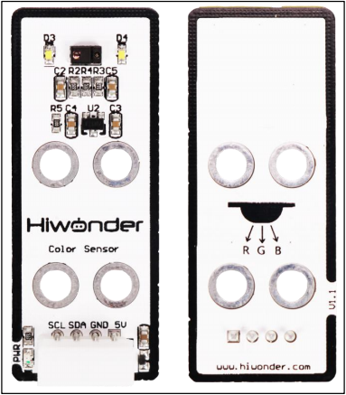
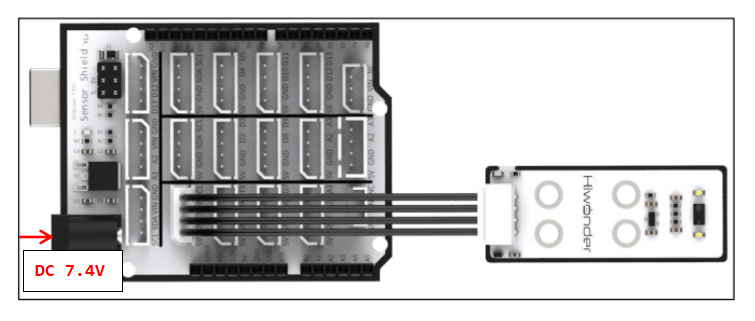
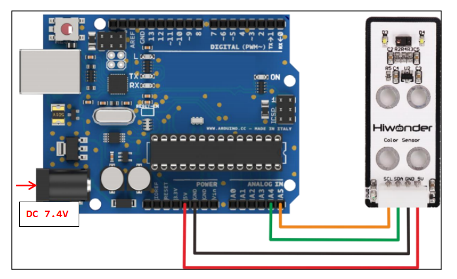
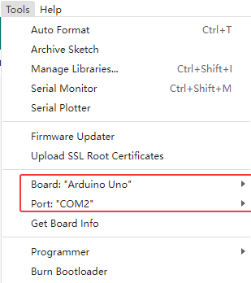
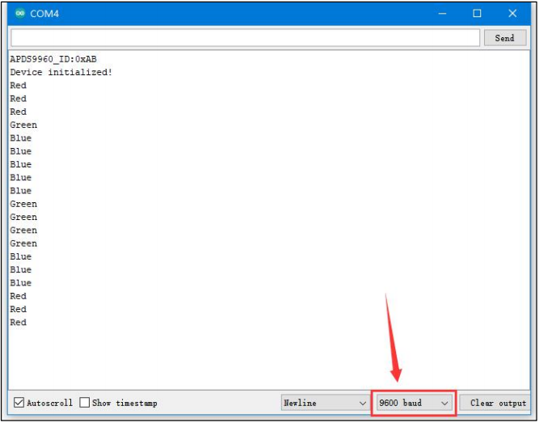

# 2. Arduino Development



## 2.1 Getting Started

### 2.1.1 Wiring Instruction

This section illustrates connecting a 4-pin cable to the A2 and A3 ports on the Arduino expansion board. Refer to the diagram below.



If you do not have an Arduino expansion board, use a Dupont wire to directly connect to the Arduino development board, just as below:



> [!NOTE]
>
> * When using Hiwonder's lithium battery, connect the battery cable with the red wire to the positive (+) terminal and the black wire to the negative (–) terminal of the DC port.
>
> * If the battery is not connected to the cables, do not connect the cable ends directly together. Doing so may cause a short circuit and damage the system.
>
> * Before powering on, ensure that no metal objects are touching the controller. Otherwise, the exposed pins at the bottom of the board may cause a short circuit and damage the controller.

### 2.1.2 Environment Configuration

You can install the Arduino IDE on a PC. Download path: **"[Appendix-> Arduino Installation Package.](https://drive.google.com/drive/folders/10erSC4tFZC-J6rFBU4RwnWtqxGZBC__U?usp=sharing)"** For detailed usage of the Arduino IDE, please refer to the documentation in the same directory.

## 2.2 Test Case

Program to use the RGB sensor to detect the corresponding color and display the color name in the terminal window.

### 2.2.1 Program Download

1)  For the Arduino and UNO development board equipped with the expansion board, use a USB cable to connect them to the computer. You can open Arduino IDE, click "**File → New,**" and import the program located in the same directory as this tutorial.

2)  Remember to select the correct development board and port. The ports shown below are for reference only. Then compile and upload the program.

    

3)  After the code is uploaded, click  to open the serial monitor, set the baud rate to 9600 to observe the output.

### 2.2.2 Project Outcome

Aim the color sensor at objects in red, green, and blue respectively. The sensor detects each color and displays the corresponding color name on the monitor.



### 2.2.3 Program Brief Analysis

- **Import Libraries**

```py
#include <SoftWire.h>
#include <Adafruit_APDS9960.h>

#define SDA A4
#define SCL A5

SoftWire sw(SDA,SCL);   //SDA Pin, SCL Pin
Adafruit_APDS9960 apds=Adafruit_APDS9960(sw);//Instantiated objects

#define RED   1
#define GREEN 2
#define BLUE  3
#define WHITE 4

int R_F = 13000;
int G_F = 19000;
int B_F = 25000;
int r_f = 768;
int g_f = 1024;
int b_f = 1280;
```

First, add the required library files. Navigate to **Project -\> Include Library -\> Manage Libraries,** then search for and add **\<SoftWire.h\>.** In addition, the **\<Adafruit_APDS9960.h\>** library is also provided and can be found in the same path. To import it, go to **Project -\> Include Library -\> Add .ZIP** Library and select the **\<Adafruit_APDS9960.h\>** file.

Program to define the sensor interfaces by connecting to the SDA and SCL pins, and to declare auxiliary variables required for use.

- **Serial Port Initialization**

```py
void setup()
{
  Serial.begin(9600);

  if(!apds.begin()){
    Serial.println("failed to initialize device! Please check your wiring.");
  }
  else 
Serial.println("Device initialized!");
  apds.enableColor(true);//Turn on the color detection feature
  delay(500);
}
```

After initializing the serial port, the program detects the color sensor and prints the chip version of the connected sensor, then enables the color detection function.

- **Color Detection Method**

```py
void colorDetect()
{
  uint16_t r, g, b, c;
  int t;
  //Color Detection Initialization Delay
  while(!apds.colorDataReady()){
    delay(5);
  }
  apds.getColorData(&r, &g, &b, &c);  //Attain three RGB color readings
  r = map(r, r_f, R_F, 0, 255);  //Value range scaling
  g = map(g, g_f, G_F, 0, 255);
  b = map(b, b_f, B_F, 0, 255);
  
  //According to the values of the three color readings, the maximum value of the reading is determined to be the current measured color. For example, if the r value is the largest, the current detection is red.
  if (r > g)
    t = RED;
  else
    t = GREEN;
  if (t == GREEN && g < b)
    t = BLUE;
  if (t == RED && r < b)
    t = BLUE;

  //If the color reading is greater than 50, return the current color value; otherwise, return 0.
  if(t == BLUE && b > 50)
  {
    Serial.println("Blue");
    return t;
  }
  else if(t == GREEN && g > 50)
  {
    Serial.println("Green");
    return t;
  }
  else if(t == RED && r > 50)
  {
    Serial.println("Red");
    return t;
  }
  else 
    return 0;
  return 0;
}
```

Program to separate the collected RGB color readings, determine which reading has the maximum value, and output the corresponding color name.

- **Loop Process**

```py
void setup()
{
  colorDetect();//Perform Color Detection
  delay(200);
}
```

Run the color detection function inside the `loop()` function.