# 3. Raspberry Pi Development Tutorial

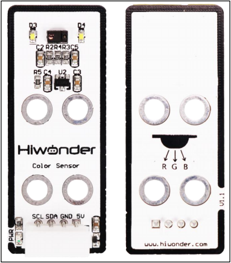

## 3.1 Getting Started

### 3.1.1 Wiring Instruction

This section provides an example of connecting the color sensor module with Dupont wires. Connect the module to the following pins: 5V, GND, SDA (GPIO24), and SCL (GPIO22). The wiring method is illustrated in the figure below.

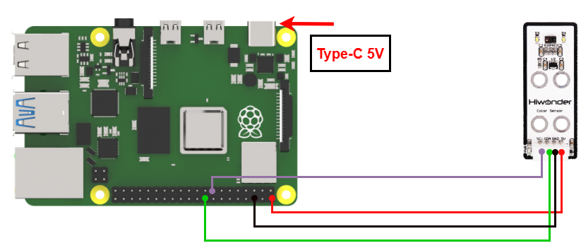

> [!NOTE]
>
> * When using Hiwonder's lithium battery, connect the battery cable with the red wire to the positive (+) terminal and the black wire to the negative (–) terminal of the DC port.
>
> * If the battery is not connected to the cables, do not connect the cable ends directly together. Doing so may cause a short circuit and damage the system.

### 3.1.2 Environment Configuration

Install NoMachine on your computer. The software package is located under "**[Appendix-> Remote Desktop Connection Tool](https://drive.google.com/drive/folders/1E7j2At6guFY7DP1m_pJMMDWaqk78y1Uq?usp=sharing)**". For the detailed operations of NoMachine, please refer to the same directory.

Drag the program and SDK library files into the Raspberry Pi system image. For demonstration purposes, the files are placed on the Desktop in this example.

> [!NOTE]
>
> **Make sure the library files are placed in the same directory as the program.**

Open the terminal and enter the command to change to the program directory: **sudo chmod a+x Sensor_Demo/**

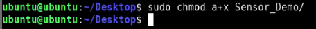

## 3.2 Test Case

In this case, the RGB sensor is used to detect the corresponding color, and the detected color name is displayed in the terminal window.

### 3.2.1 Program Download

1)  Open the terminal and enter the command to navigate to the program directory, enter: **cd Desktop/Sensor_Demo/**, then press Enter.

2)  To run this example program, enter: **python3 ColorSensorDemo.py**

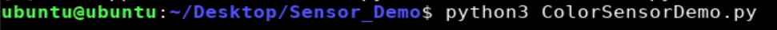

### 3.2.2 Project Outcome

Aim the color sensor at objects in red, green, and blue respectively. The sensor detects each color and displays the corresponding color name on the monitor.

### 3.2.3 Program Brief Analysis

- **Import Libraries**

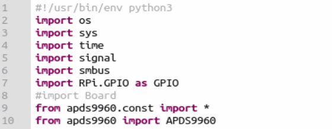

- **Check the running Python version**

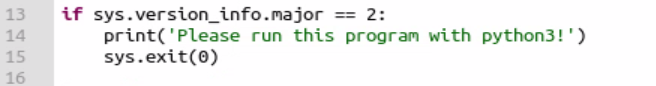

Check if the running Python version is 3.0 or higher.

If yes, the program runs normally; if not, it prints a message via the `print()` function and exits.

- **Define Color Calibration Values**

Describe the saturation of the red, green, and blue colors.

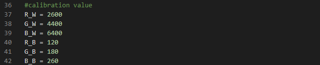

Initialize the color sensor.

Initialize communication with the APDS9960 color sensor and enable the color sensor function.

Detect interrupt signal

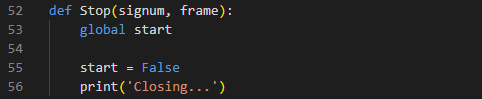

When "**Ctrl+C**" is pressed to interrupt the program, it prints "**Shutting down...**" and sets the global variable start to False.

Color Detection

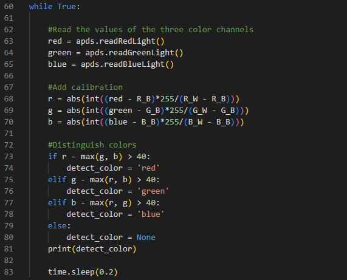

1)  Use the method of **APDS9960** library to read the red, green, and blue channel values.

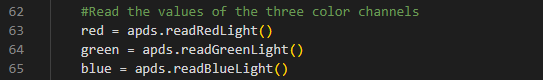

2)  Calibrate and adjust the range of the red, green, and blue color channel values.

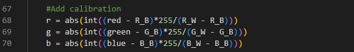

3)  Determine the dominant color in the current environment based on the values of the three color channels.

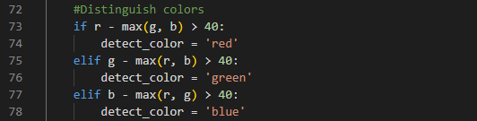

4)  Print the detected color or None. So you can identify the dominant color in the current environment.

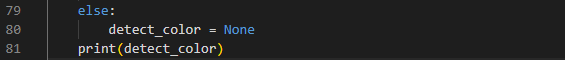

5)  Pause the code for 0.2 seconds before repeating, in order to control the detection frequency.

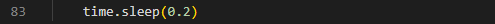