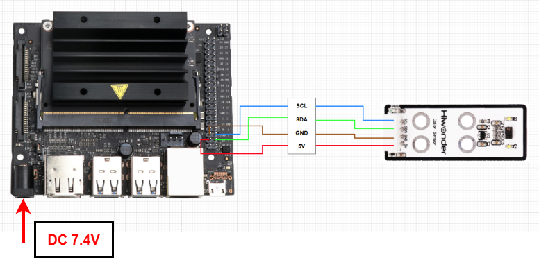

# 4. Jetson Development Tutorial

## 4.1 Getting Started

### 4.1.1 Wiring Instruction

This section uses DuPont wires to connect fan modules. For wiring instructions, refer to the figure below:

> [!NOTE]
>
> **Before powering on, ensure that no metal objects are touching the controller. Otherwise, the exposed pins at the bottom of the board may cause a short circuit and damage the controller.**

<table class="docutils-nobg" border="1">
<colgroup>
<col style="width: 20%" />
<col style="width: 20%" />
<col style="width: 20%" />
<col style="width: 20%" />
<col style="width: 20%" />
</colgroup>
<tbody>
<tr>
<td colspan="5" style="text-align: center;">

<strong>Connection diagram</strong>

</td>
</tr>
<tr>
<td style="text-align: center;">

<strong>Item</strong>

</td>
<td style="text-align: center;">

<strong>Pin</strong>

</td>
<td style="text-align: center;">

<strong>Connection method</strong>

</td>
<td style="text-align: center;">

<strong>Item</strong>

</td>
<td style="text-align: center;">

<strong>Pin</strong>

</td>
</tr>
<tr>
<td style="text-align: center;">

Jetson Nano

</td>
<td style="text-align: center;">

<strong>SCL (pin 5)</strong>

</td>
<td style="text-align: center;">

Dupont wire

</td>
<td style="text-align: center;">

Color Sensor

</td>
<td style="text-align: center;">

<strong>SCL</strong>

</td>
</tr>
<tr>
<td style="text-align: center;">

Jetson Nano

</td>
<td style="text-align: center;">

<strong>SDA (pin 3)</strong>

</td>
<td style="text-align: center;">

Dupont wire

</td>
<td style="text-align: center;">

Color Sensor

</td>
<td style="text-align: center;">

<strong>SDA</strong>

</td>
</tr>
<tr>
<td style="text-align: center;">

Jetson Nano

</td>
<td style="text-align: center;">

<strong>GND</strong>

</td>
<td style="text-align: center;">

Dupont wire

</td>
<td style="text-align: center;">

Color Sensor

</td>
<td style="text-align: center;">

<strong>GND</strong>

</td>
</tr>
<tr>
<td style="text-align: center;">

Jetson Nano

</td>
<td style="text-align: center;">

<strong>5V</strong>

</td>
<td style="text-align: center;">

Dupont wire

</td>
<td style="text-align: center;">

Color Sensor

</td>
<td style="text-align: center;">

<strong>5V</strong>

</td>
</tr>
</tbody>
</table>

### 4.1.2 Environment Configuration

Install NoMachine on your computer. The software package is located under "**[Appendix-> Remote Desktop Connection Tool](https://drive.google.com/drive/folders/1E7j2At6guFY7DP1m_pJMMDWaqk78y1Uq?usp=sharing)**". For the detailed operations of NoMachine, please refer to the the same directory.

Drag the program into the Jetson Nano system image. For demonstration purposes, the files are placed on the Desktop in this example.

## 4.2 Test Case

Program to display the color sensor detection results in the Jetson terminal window.

### 4.2.1 Program Download

1)  Open the terminal and enter the following command to navigate to the program directory:

"**cd Desktop/**", and press Enter

2)  Run the program by entering:

"**python3 ColorSensorDemo.py** "

### 4.2.2 Project Outcome

Place the object in the color sensor's recognition area, the sensor then determines the closest match among red, green, and blue, and prints the result to the terminal.

### 4.2.3 Program Brief Analysis

- **Import Libraries**

Import the library files required by the program, including the system file os, time processing function time, GPIO function, and **APDS9960** library files used by the color sensor. Meanwhile, the program will detect the currently used Python version and will issue a prompt if it is not Python 3.

- **Initialization Sequence**

Then set the RGB calibration value of the color sensor and initialize the color sensor through the APDS library, so that the color sensor can set the initial value of color detection.

Set the variable start to True for the color sensor to start detecting, and set the shutdown function. When the terminal receives the shutdown signal, it will set the variable start to False to shut down the detection.

- **Main Function**

In the while loop, use the functions `apds.readRedLight`, `apds.readGreenLight`, and `apds.readBlueLight` to read the channel values of the RGB primary colors.

Next, add the calibration data and use conditional statements to determine which RGB component has the highest proportion, thereby identifying the target color. For example, if the R component is greater than the maximum of the G and B components by more than 40 units, the target is identified as red.

